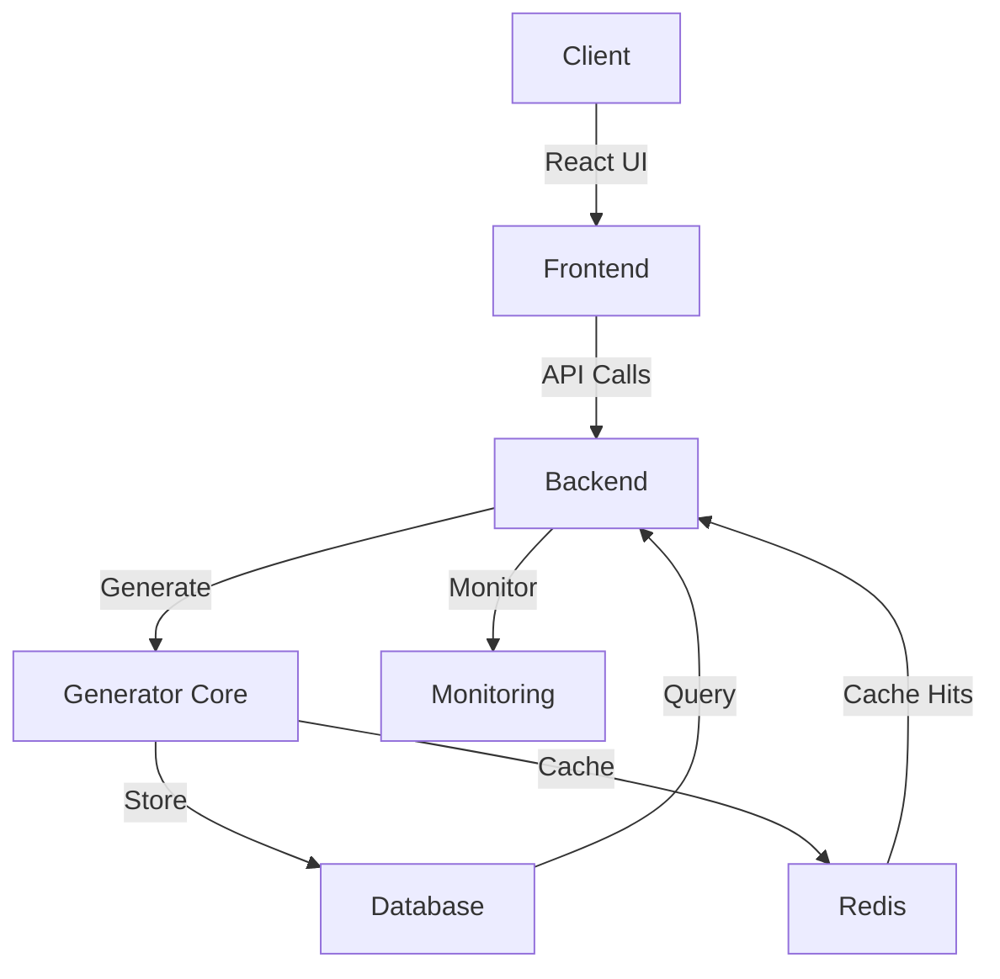
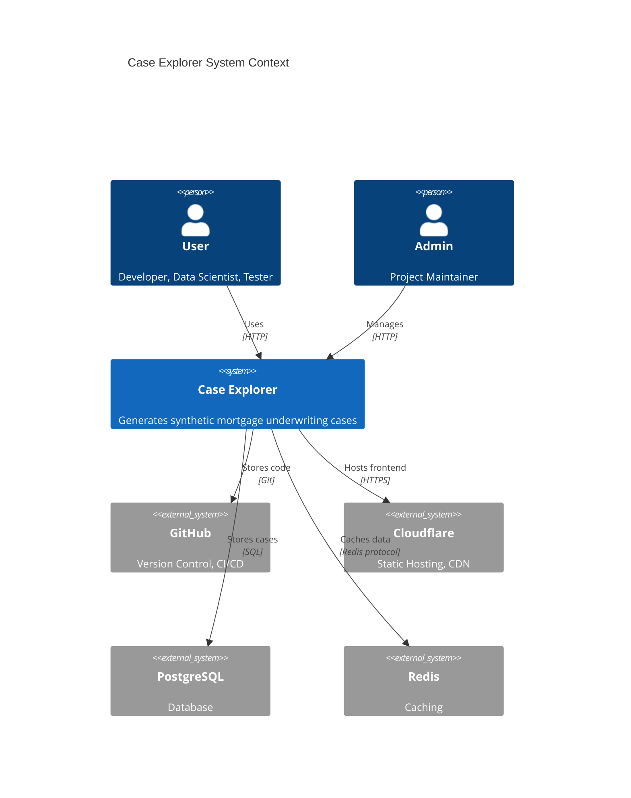
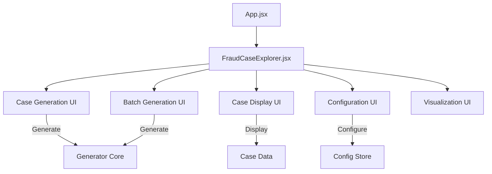
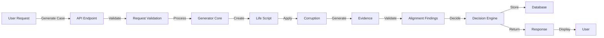
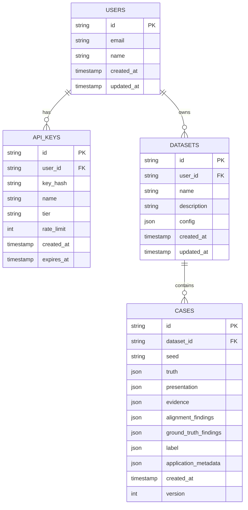

# Case Explorer Architecture

## 🏗️ System Overview

Case Explorer is a **React + Vite** application with a **Node.js** backend that generates synthetic mortgage underwriting cases for ML training, fraud detection, and UI stress-testing.



## 📦 High-Level Architecture



## 🧩 Component Architecture

### 1. Frontend (React + Vite)

**Location**: `src/`



**Key Files**:
- `App.jsx` - Main entry point
- `main.jsx` - React DOM rendering
- `FraudCaseExplorer.jsx` - Primary UI component
- `index.css` - Global styles
- `assets/` - Static assets

**Technologies**:
- React 19
- Vite 8
- Oxlint (ESLint)

### 2. Backend (Node.js + Express)

**Location**: `src/server.js` (to be created)

```mermaid
flowchart TD
    A[Express Server] --> B[Routes]
    B --> C[/api/cases]
    B --> D[/api/batch]
    B --> E[/api/auth]
    C --> F[Case Controller]
    D --> G[Batch Controller]
    E --> H[Auth Controller]
    F --> I[Generator Service]
    G --> I
    I --> J[Generator Core]
    J --> K[Statistical Sampling]
    J --> L[Corruption Engine]
    J --> M[Evidence Synthesizer]
    J --> N[Decision Engine]
    I --> O[Database Service]
    I --> P[Cache Service]
```

**Key Components**:
- **Routes**: REST API endpoints
- **Controllers**: Handle HTTP requests/responses
- **Services**: Business logic layer
- **Generator Core**: Existing `src/generator.js` logic
- **Database Service**: PostgreSQL integration
- **Cache Service**: Redis integration

**Technologies**:
- Node.js 20+
- Express.js
- PostgreSQL
- Redis
- Cloudflare Workers (for serverless)

### 3. Generator Core

**Location**: `src/generator.js` (1820 lines)

```mermaid
flowchart TD
    A[generateCase] --> B[generateLifeScript]
    A --> C[corruptPresentation]
    A --> D[synthesizeEvidence]
    A --> E[generateAlignmentFindings]
    A --> F[generateGroundTruthFindings]
    A --> G[computeDecision]
    A --> H[generateApplicationMetadata]

    B --> I[sampleCorrelatedPrimitives]
    B --> J[generateDemographics]
    B --> K[generateEmployment]
    B --> L[generateLiabilities]
    B --> M[generateHousingHistory]
    B --> N[generateAssets]
    B --> O[generateCreditScore]
    B --> P[generateIncomeStream]
    B --> Q[generateExpenseObligations]
    B --> R[simulateMonthlyLedger]

    I --> S[Gaussian Copula]
    I --> T[Cholesky Decomposition]
    I --> U[Inverse CDF Sampling]

    C --> V[INFLATION]
    C --> W[CONCEALMENT]
    C --> X[FABRICATION]
    C --> Y[BUST_OUT]
    C --> Z[EVIDENCE_TAMPERING]

    G --> AA[maxAlignmentLevel]
    G --> BB[mapFraudRisk]
    G --> CC[mapCoherence]
    G --> DD[mapCaseCoherenceStatus]
```



**Core Functions**:
- `generateCase(id, config, corruptionType, severity, seed)` - Main entry point
- `generateLifeScript(entityId, config, rng)` - Generate financial life
- `corruptPresentation(truth, corruptionType, severity, config, rng)` - Apply fraud patterns
- `synthesizeEvidence(truth, rng)` - Generate evidence documents
- `generateAlignmentFindings(truth, presentation, evidence, metadata)` - 12-dimension validation
- `computeDecision(...)` - Underwriting decision engine
- `extractMLFeatures(c)` - Feature extraction for ML
- `casesToCsv(cases)` - CSV export

**Statistical Primitives**:
- Normal distribution sampling
- Lognormal distribution sampling
- Beta distribution sampling
- Gamma distribution sampling
- Exponential distribution sampling
- Gaussian copula with Cholesky decomposition

### 4. Data Flow



**Request Flow**:
1. User submits generation request via UI or API
2. Request is validated (parameters, authentication)
3. Generator creates life script (demographics, employment, finances)
4. Corruption is applied based on type and severity
5. Evidence documents are synthesized from truth
6. Alignment findings are generated (12 dimensions)
7. Decision is computed (APPROVE/MANUAL_REVIEW/DECLINE)
8. Case is stored in database (if persistence enabled)
9. Response is returned to user

### 5. Database Schema



### 6. Technology Stack

| **Layer** | **Technology** | **Purpose** | **Status** |
|-----------|---------------|-------------|------------|
| **Frontend** | React 19 | UI Framework | ✅ Current |
| **Frontend** | Vite 8 | Build Tool | ✅ Current |
| **Frontend** | Oxlint | Linting | ✅ Current |
| **Backend** | Node.js 20+ | Runtime | ⚠️ To Add |
| **Backend** | Express.js | Web Framework | ⚠️ To Add |
| **Database** | PostgreSQL | Primary DB | ⚠️ To Add |
| **Cache** | Redis | Caching Layer | ⚠️ To Add |
| **Hosting** | Cloudflare Pages | Static Frontend | ⚠️ To Add |
| **Hosting** | Cloudflare Workers | API Backend | ⚠️ To Add |
| **CI/CD** | GitHub Actions | Automation | ⚠️ To Add |
| **Monitoring** | Sentry | Error Tracking | ⚠️ To Add |
| **Monitoring** | Cloudflare Analytics | Usage Metrics | ⚠️ To Add |

### 7. Deployment Architecture

```mermaid
C4Deployment
    title Case Explorer Deployment Architecture

    DeploymentNode(development, "Development", "Local Machine") {
        DeploymentNode(localFrontend, "Frontend", "localhost:5173") {
            Container(spa, "React SPA", "Vite Dev Server")
        }
        DeploymentNode(localBackend, "Backend", "localhost:3000") {
            Container(api, "Express API", "Node.js")
            Container(db, "PostgreSQL", "Docker Container")
        }
    }

    DeploymentNode(staging, "Staging", "Cloudflare") {
        DeploymentNode(cfPages, "Frontend", "Cloudflare Pages") {
            Container(spa, "React SPA", "Static Files")
        }
        DeploymentNode(cfWorkers, "Backend", "Cloudflare Workers") {
            Container(api, "API Server", "Worker Script")
        }
        DeploymentNode(cfD1, "Database", "Cloudflare D1") {
            Container(db, "PostgreSQL", "D1 Database")
        }
    }

    DeploymentNode(production, "Production", "Cloudflare") {
        DeploymentNode(cfPagesProd, "Frontend", "Cloudflare Pages") {
            Container(spa, "React SPA", "Static Files")
        }
        DeploymentNode(cfWorkersProd, "Backend", "Cloudflare Workers") {
            Container(api, "API Server", "Worker Script")
        }
        DeploymentNode(cfD1Prod, "Database", "Cloudflare D1") {
            Container(db, "PostgreSQL", "D1 Database")
        }
        DeploymentNode(cfR2, "Storage", "Cloudflare R2") {
            Container(storage, "Object Storage", "R2 Bucket")
        }
    }

    Rel(localFrontend, localBackend, "API Calls", "HTTP")
    Rel(cfPages, cfWorkers, "API Calls", "HTTPS")
    Rel(cfWorkers, cfD1, "Database", "SQL")
    Rel(cfWorkersProd, cfD1Prod, "Database", "SQL")
    Rel(cfWorkersProd, cfR2, "Storage", "S3 API")
```

### 8. Configuration Management

**Environment Variables**:
```bash
# Database
DB_HOST=localhost
DB_PORT=5432
DB_NAME=case_explorer
DB_USER=postgres
DB_PASSWORD=secret

# Redis
REDIS_HOST=localhost
REDIS_PORT=6379
REDIS_PASSWORD=

# API
API_PORT=3000
API_SECRET=supersecretkey
JWT_SECRET=anothersecret

# Rate Limiting
RATE_LIMIT_FREE=1000
RATE_LIMIT_PRO=10000
RATE_LIMIT_WINDOW=3600

# Cloudflare
CF_ACCOUNT_ID=
CF_API_TOKEN=
```

**Configuration Files**:
- `src/distribution_config.json` - Core generation parameters
- `.env` - Environment variables (not committed)
- `.env.example` - Example environment variables (committed)
- `vite.config.js` - Vite configuration
- `package.json` - Dependencies and scripts

### 9. Performance Considerations

**Bottlenecks**:
- Statistical sampling (CPU-intensive)
- Batch generation (memory-intensive for large N)
- Database queries (can be cached)

**Optimizations**:
- Worker threads for parallel generation
- Redis caching for common queries
- Lazy evaluation for large batches
- Connection pooling for database
- Stream processing for CSV export

**Scalability Limits**:
- Node.js single-thread: ~100 cases/sec
- With worker threads: ~500-1000 cases/sec
- Memory: ~100MB per 10K cases
- Database: PostgreSQL can handle millions of cases

### 10. Security Considerations

**Authentication**:
- API key authentication for API endpoints
- JWT for session management (future)
- Rate limiting per API key

**Data Protection**:
- All data is synthetic (no PII)
- API keys are hashed (never stored plaintext)
- HTTPS enforced everywhere

**Input Validation**:
- All API inputs are validated
- Query parameters are sanitized
- Request bodies are schema-validated

**Vulnerabilities**:
- None identified (all data is synthetic)
- Seed exposure is acceptable (deterministic generation)

### 11. Future Architecture Evolution

**Short-term (0-6 months)**:
- Add TypeScript
- Modularize generator
- Add database persistence
- Deploy to Cloudflare

**Medium-term (6-12 months)**:
- Microservices architecture
- Separate frontend/backend repos
- Message queue for async generation
- Multiple database shards

**Long-term (12+ months)**:
- Kubernetes deployment
- Auto-scaling based on load
- Multi-region deployment
- Advanced caching strategies

---

*Last updated: 2026-07-31*
*Maintainer: @emkwambe*
